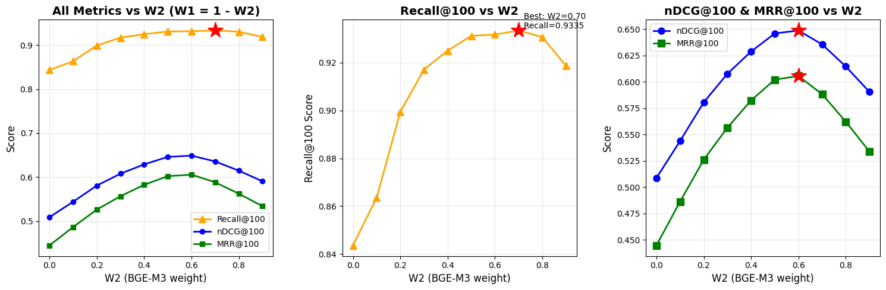
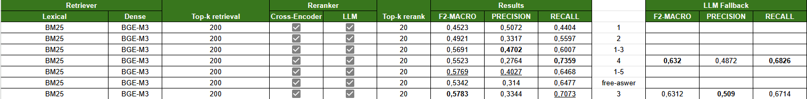

# UIT-DS310: Legal Document Retrieval and Reranking System

A Vietnamese legal document retrieval and reranking system using hybrid retrieval and multi-stage reranking techniques for VLSP 2025 DRiLL (Document Retrieval for Legal Learning) competition.

## Overview

The system is built with a 2-stage architecture:
- **Stage 1 (Retrieval)**: Hybrid retrieval combining BM25 (lexical) and BGE-M3 (dense) with weighted ensemble
- **Stage 2 (Reranking)**: Multi-stage reranking using Cross-Encoder ensemble and LLM reranker

## Project Structure

```
UIT-DS310/
├── config/              # Configuration files
│   ├── config.yaml      # Base configuration
│   └── exp_*.yaml       # Experiment configurations
├── src/
│   ├── data/            # Data preprocessing
│   ├── embeddings/      # Embedding models
│   ├── retrieval/       # Retrieval modules
│   ├── reranking/       # Reranking modules
│   ├── fusion/          # Fusion methods (RRF, Weighted)
│   └── evaluation/      # Evaluation metrics
├── scripts/             # Utility scripts
├── dataset/             # Dataset files
├── data/                # Indexes and databases
└── main.py             # Main entry point
```

## Requirements & Installation

### Requirements

- Python 3.8+
- CUDA-capable GPU (recommended 16GB+ VRAM)
- PyTorch 2.0+

### Installation

```bash
pip install -r requirements.txt
```

### Data Structure

Ensure the following files are available:
- `dataset/legal_corpus.json`: Legal corpus
- `dataset/train.json`: Training questions
- `dataset/public_test.json`: Public test questions
- `dataset/private_test.json`: Private test questions
- `data/bm25_index.pkl`: BM25 index
- `data/chroma_db_retriever/`: ChromaDB for retriever
- `data/chroma_db_reranker/`: ChromaDB for reranker

## Dataset

### VLSP 2025 DRiLL Dataset Statistics

| Dataset | Total (rows) | Max (words) | Min (words) | Avg (words) |
|---------|--------------|------------|-------------|-------------|
| Train (Articles) | 59,635 | 55,097 | 0 | 303.24 |
| Train (Questions) | 2,190 | 45 | 6 | 19.71 |
| Public Test (Questions) | 312 | 42 | 11 | 20.00 |
| Private Test (Questions) | 627 | 44 | 11 | 19.90 |

## Pipeline Architecture


*Note: Detailed pipeline diagram will be replaced here*

## Stage 1: Retrieval

### Description

The retrieval stage uses a hybrid approach combining two methods:
- **Lexical Retrieval (BM25)**: Keyword-based search, suitable for exact matching
- **Dense Retrieval (BGE-M3)**: Semantic search using BGE-M3 embedding model

### Techniques

**Preprocessing:**
- Unicode normalization for Vietnamese text
- Tokenization using Vietnamese word tokenizer
- Chunking with `chunk_size=512`, `overlap=64` for retriever

**Embedding Model:**
- **BGE-M3** (`BAAI/bge-m3`): Multilingual embedding model with 1024 dimensions
- Embeddings stored in ChromaDB with collection `retriever_legal_articles`

**Fusion Method:**
- **Weighted Ensemble**: Combines scores from BM25 and BGE-M3
  - Score = W1 × BM25_score + W2 × BGE-M3_score
  - W1 + W2 = 1.0
- Grid search on training set to find optimal weights

### Grid Search Results

Grid search was performed on the training set (using public training questions only, no test leakage) to optimize weights W1 (BM25) and W2 (BGE-M3):



**Optimal Weights:**
- W1 (BM25) = 0.3
- W2 (BGE-M3) = 0.7

**Top-k Retrieval:** 200 candidates returned from stage 1

## Stage 2: Reranking

### Description

The reranking stage uses two layers:
1. **Cross-Encoder Ensemble**: Combines 2 cross-encoder rerankers using RRF
2. **LLM Reranker**: Uses Qwen models to rerank remaining candidates

### Cross-Encoder Rerankers

**Models:**
- **GTE Reranker** (`Booooooooooooo/gte-reranker-10e`): Fine-tuned from GTE reranker
- **BGE-V2 Reranker** (`Booooooooooooo/bge-v2-reranker-10e`): Fine-tuned from BGE-V2 reranker

**Fusion Method:**
- **RRF (Reciprocal Rank Fusion)**: Combines rankings from 2 rerankers
  - RRF parameter k = 60

**Preprocessing:**
- Chunking with `chunk_size=2048`, `overlap=128` for reranker
- Documents stored in ChromaDB with collection `reranker_legal_articles`

**Top-k after Cross-Encoder:** 20 candidates selected for LLM reranker

### LLM Reranker

**Main Model:**
- **Qwen/Qwen3-4B-Instruct-2507**: Used for main reranking
  - Compact model, computationally efficient
  - Achieves high recall on test set

**Fallback Model:**
- **Qwen/Qwen2.5-7B-Instruct**: Used to improve precision in difficult or ambiguous queries
  - Larger model with better context understanding
  - Applied when higher precision is required or when Qwen3-4B outputs uncertain rankings

**Inference:**
- **vLLM**: Used for efficient LLM inference with continuous batching
- **GPU Hardware**: 
  - A4000 (gpu renting)
  - P100 (Kaggle)
  - T4x2 (Kaggle)

**Configuration:**
- Temperature: 0.1 (for stable output)
- Max new tokens: 50
- Threshold: 0.8 (to filter irrelevant documents)
- 4-bit quantization: Enabled (to save VRAM)
- Max content length: 4096 tokens

**Top-k Final:** 1-3 articles depending on experiment configuration

## Results

### Stage-wise Results on Private Test

#### Retrieval Stage Results (P@200, R@200)

| Method | P@200 | R@200 |
|--------|-------|-------|
| BM25 | 0.0067 | 0.8972 |
| BGE-M3 | 0.0074 | 0.9693 |
| Hybrid | 0.0063 | 0.9698 |

#### Reranking Stage Results (P@20, R@20)

| Method | P@20 | R@20 |
|--------|------|------|
| GTE | 0.0494 | 0.793 |
| BGE-V2 | 0.0463 | 0.7514 |
| RRF | 0.053 | 0.8532 |

### Full Pipeline Results on Private Test



### Detailed Results

Evaluation results table for different configurations:

| LLM Output | Lexical | Dense | Top-k Retrieval | Reranker | Top-k Rerank | F2-Macro | Precision | Recall |
|-------------------|---------|-------|-----------------|----------|--------------|----------|-----------|--------|
| 1 | BM25 | BGE-M3 | 200 | Cross-Enc + LLM | 20 | 0.4523 | 0.5072 | 0.4404 |
| 2 | BM25 | BGE-M3 | 200 | Cross-Enc + LLM | 20 | 0.4921 | 0.3317 | 0.5597 |
| 1–3 | BM25 | BGE-M3 | 200 | Cross-Enc + LLM | 20 | 0.5691 | **0.4702** | 0.6007 |
| 4 | BM25 | BGE-M3 | 200 | Cross-Enc + LLM | 20 | 0.5523 | 0.2764 | **0.7359** |
| 1–5 | BM25 | BGE-M3 | 200 | Cross-Enc + LLM | 20 | 0.5769 | **0.4027** | 0.6468 |
| free-answer | BM25 | BGE-M3 | 200 | Cross-Enc + LLM | 20 | 0.5342 | 0.3140 | 0.6477 |
| 3 | BM25 | BGE-M3 | 200 | Cross-Enc + LLM | 20 | 0.5783 | 0.3344 | 0.7073 |

### LLM Fallback Results

Results when using Qwen/Qwen2.5-7B-Instruct as fallback model:

| Config | F2-MACRO | Precision | Recall |
|--------|----------|-----------|--------|
| 6 (Free-answer) | 0.632 | 0.4872 | 0.6826 |
| 3 | 0.6312 | 0.509 | 0.6714 |

## Usage

### Running Experiments

```bash
python main.py --exp <experiment_number> --input <test_file> --output <output_file>
```

Example:
```bash
python main.py --exp 7 --input ./dataset/private_test.json --output ./results/exp_7_results.json
```

### Configuration

Experiment configurations are defined in `config/exp_*.yaml`:
- `exp_1.yaml` to `exp_12.yaml`: Different experiment configurations